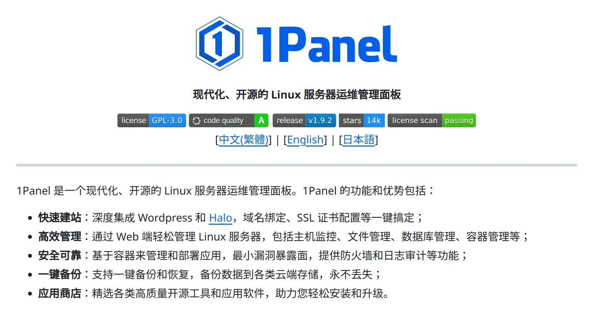
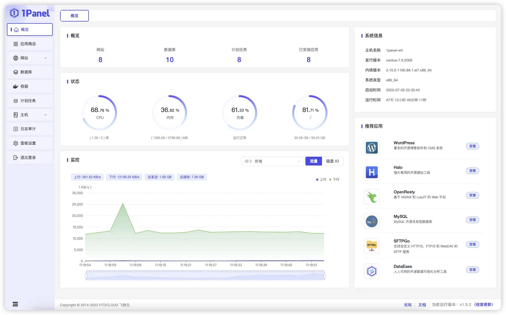
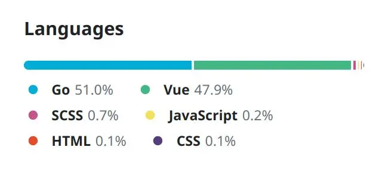
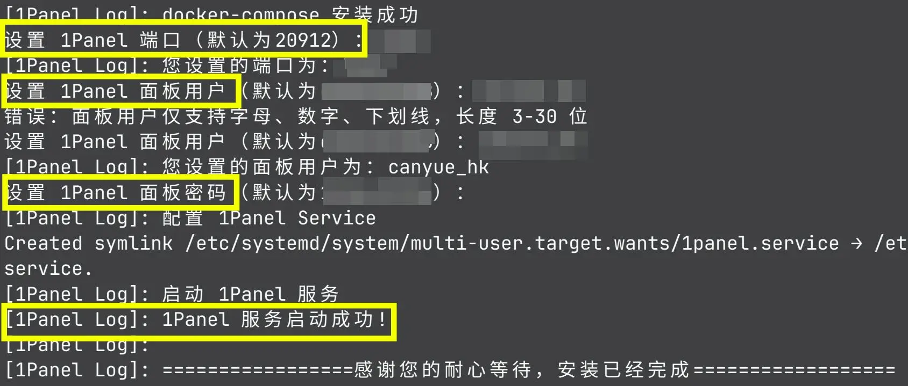
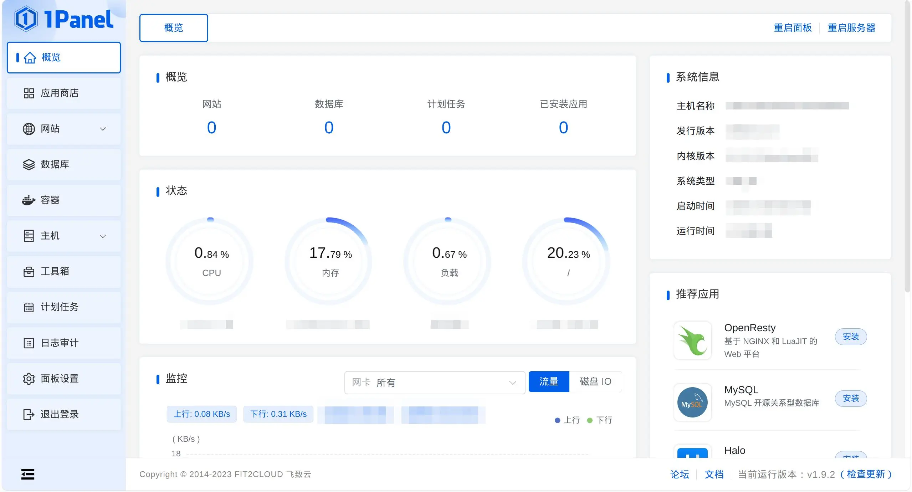
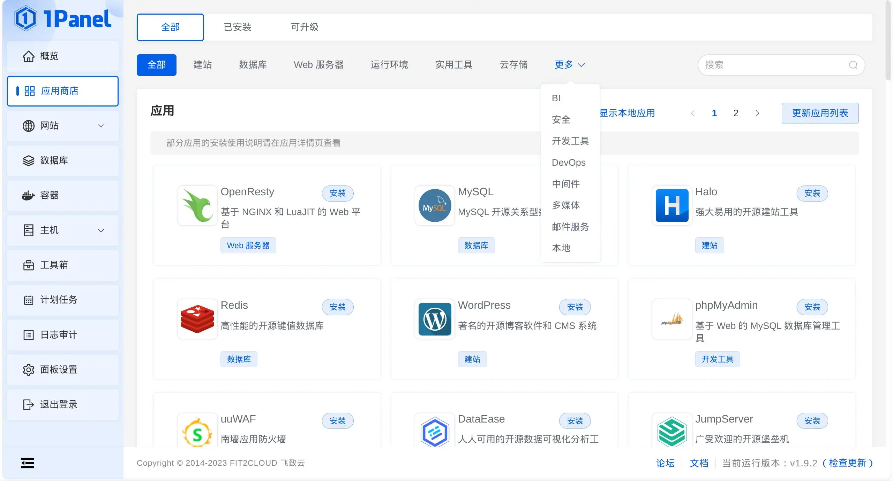
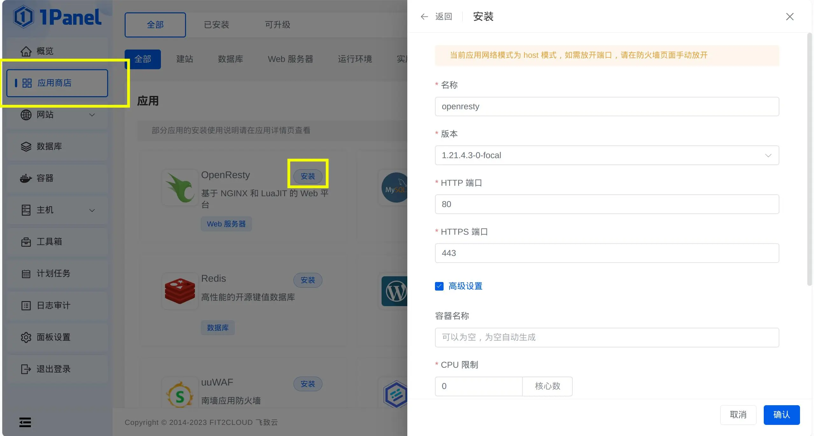
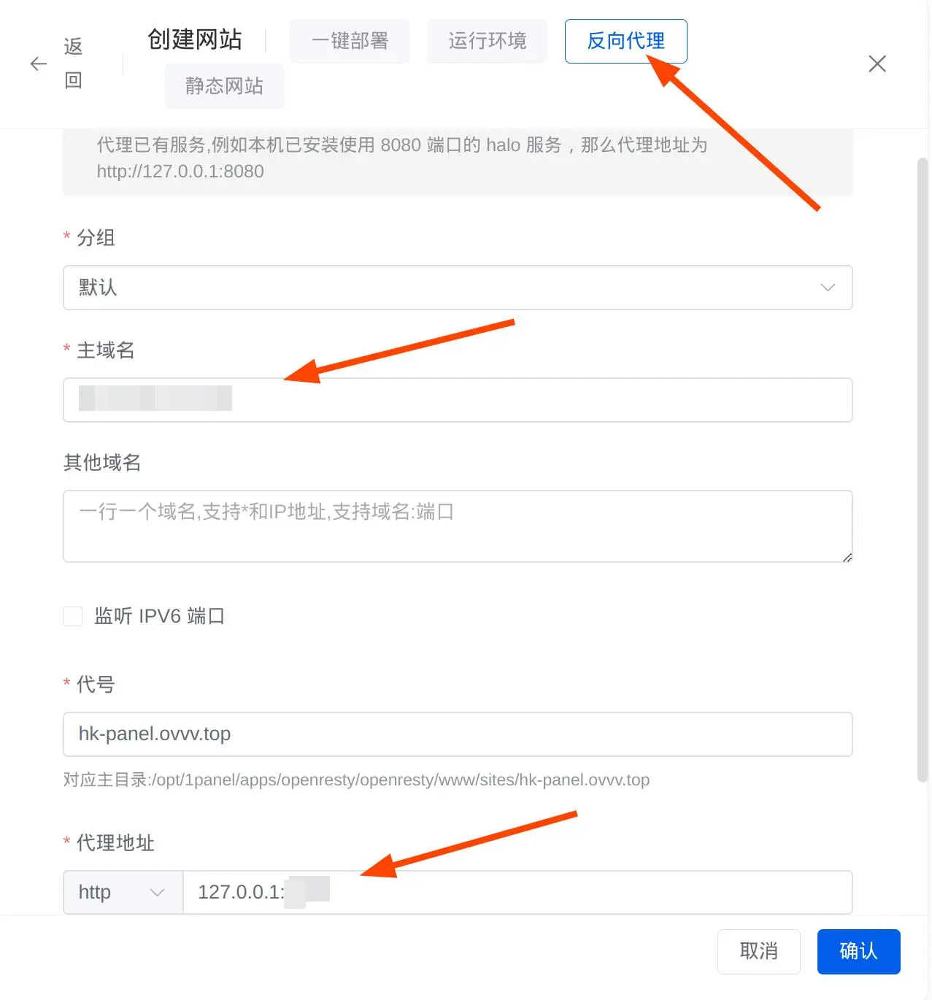

> 本文档为 1panel 配置教程，主要介绍 1panel 的配置及使用。更多信息请参照官网
> 部署条件：一台能 ssh 登录的服务器，一个域名

> 最后实现的效果：安装配置 1panel 并配置反向代理，使用域名访问 1panel 面板。

### 1. 1panel 是什么？

<center>1panel 的 Github 仓库：<a href="https://github.com/1Panel-dev/1Panel">https://github.com/1Panel-dev/1Panel<a/></center>
<br>

宝塔面板是比较知名的服务器管理面板，但是它`不开源`，`UI 也不好看`，登录时甚至还`要求绑定宝塔官网账号`，否则就无法继续使用面板！

如此种种便促使我们寻找替代品。我的服务器在 11 月份左右过期了，新的服务器不想使用宝塔面板，但是不使用面板操作服务器还是不太方便（比如设置反向代理、申请域名 SSL 证书和管理 docker 应用，面板可视化点击几下就好了，命令行操作起来很折磨人），于是便寻找它的替代品，也就是我们今天的主角 —— `1panel`。



项目还采用的是 vue 编写的前端，算是比较先进的技术栈。后端采用 GO 编写。


你可以访问这个连接来体验一下 1panel 的功能：[https://demo.1panel.cn](https://demo.1panel.cn)

经过一两个月的使用，我觉得现在体验相当稳定，写这篇教程，希望能帮助到大家。

### 2. 1panel 安装

先确保你的服务器安装了 `curl`，没有就自行安装。

如果服务器是 `debian` 系列的系统，执行下面命令安装 curl
```bash
sudo apt install curl
```
其他系统请自行搜索安装 curl 的方法。

开始安装 1panel。

1) ssh 连接到你的服务器，然后执行下面的命令，安装 1panel。
```bash
curl -sSL https://resource.fit2cloud.com/1panel/package/quick_start.sh -o quick_start.sh && sudo bash quick_start.sh
```

2) 命令行提示输入安装目录，敲回车 默认即可

后面命令行会输出一大串安装日志，等待即可。

3) 命令行提示输入端口号，你可以自定义，也可以用它给你默认的端口号。
注意 如果你使用的是云服务器，请至安全组开放 `输入的端口`


如果没有什么报错的话，那么恭喜你，1panel 已经安装成功了。


现在在浏览器访问 命令行输出的 `外网地址` 就可以登陆 1panel 面板了。
`面板用户名和密码`也在命令行输出，如上图所示。


如果出现错误很可能是网络连接问题（服务器下载面板资源出错）或者 ssh 连接断开了，重新执行安装命令即可。具体错误信息请自行搜索解决。

### 3. 安装 `openresty` 应用

登陆以后我们可以看到 1panel 的界面，如下图所示。


首页显示的是服务器的基本信息，我们可以看到服务器的内存、cpu、硬盘、负载等信息。
右边显示的是系统信息，我们可以看到系统的发行版本、内核、主机名等信息。

我们点击应用商店，这里有 1panel 社区维护的一些应用，我们可以直接安装使用。
应用商店包括了一些很热门的应用和开源项目 如：`AList` `MySQL` `Mariadb` `WordPress` `Typecho` `Gitea` `Jenkins` `Redis` `MongoDB` `PostgreSQL` `RabbitMQ`  等等。都是运行在 docker 容器中的，安装和卸载都很方便。



我们安装 `openresty` 应用。这是一个 nginx 的衍生版本，支持 lua 脚本，我们可以用它来做反向代理。
（不知道为啥没有 `nginx`，但是这个也挺好用的，没差）
安装了它才能编辑网页、配置反代。

不要改配置！直接点确定即可。

### 4. 设置域名解析
域名服务商设置域名解析，将域名解析到服务器的 IP 上。这里应该不用我多教。


### 5. 配置反向代理
点击网页左侧的 `网站`，然后点击 `创建网站`，填入域名和端口号，点击确定。
选择反向代理


配置好后，就可以使用域名访问 1panel 面板了。

### 6. 申请域名 SSL 证书
由于我的域名托管在 Cloudflare，域名流量经过他 proxied，不需要手动申请。如果你的域名托管在其他地方，那么你可以使用 1panel 申请 SSL 证书。
留个坑 如果有需要我再补充。
