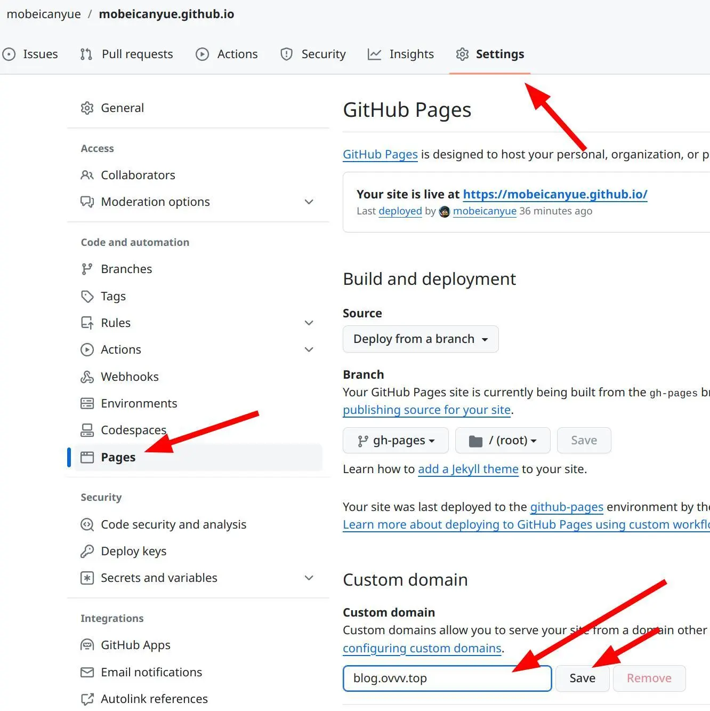
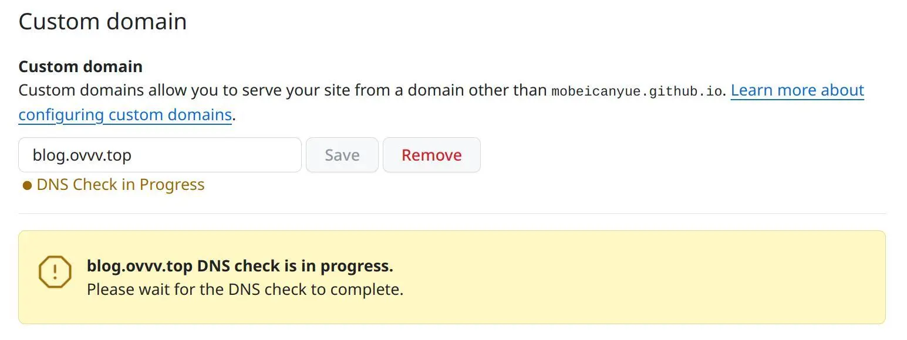
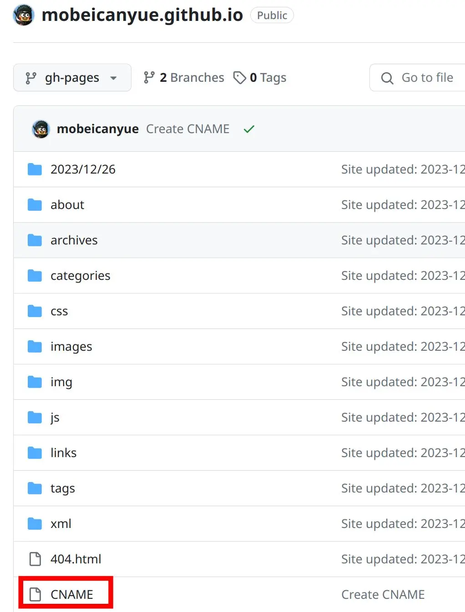
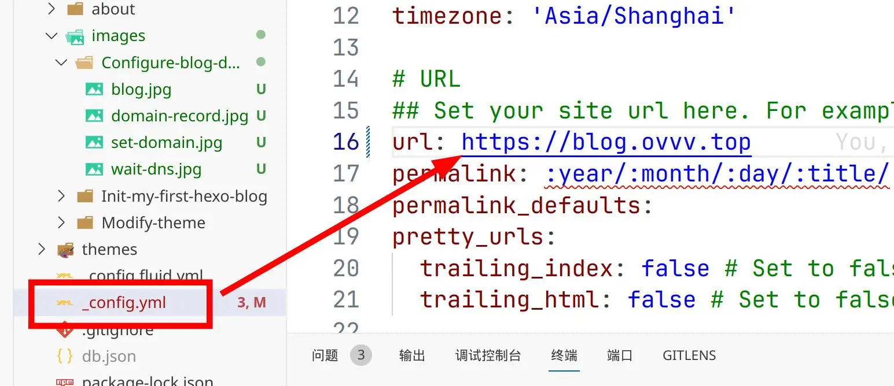

> 前置条件：已经有一个域名，且跟着前面的文章配置好了 github pages。

### 1. 在域名服务商处配置域名解析
域名解析，不同的服务商有不同的配置方式。
类型 选择 CNAME，主机记录填写你的域名，比如 `example.com`，
值填写 `用户名.github.io`，比如 `mobeicanyue.github.io`。


### 2. 在 github 仓库中配置域名

进入你的仓库，点击 `settings`，左边栏，找到 `Pages`，在 `Custom domain` 中填写你的域名，比如 `example.com`，然后点击 `Save`。


等待 dns 检查，很快就好了。

访问你的域名，比如 `example.com`，就可以看到你的博客了。

此时可以注意到在 gh-pages 分支中多了一个 CNAME 文件，这个文件内容就是我们刚刚配置的域名。

但是按照之前的配置，每次 github action 部署的时候，都会把这个文件给覆盖掉，所以我们后面需要修改一下配置。


### 3. 修改 hexo 配置文件
在 hexo 的配置文件 `_config.yml` 中，找到 `url`，把 `url` 改成你的域名，比如 `https://example.com`。



### 4. 修改 Github Actions 自动部署
由于我们之前那种写法，在 github action 部署到 github pages 的时候，会把 CNAME 文件给覆盖掉，所以我们需要修改一下 github action 配置。

也就是把之前的
    
```yml
- name: Deploy Hexo
    run: |
        hexo clean
        hexo generate
        hexo deploy
```

换成
    
```yml
- name: Build Site
        run: |
          export TZ='Asia/Shanghai'
          npm run clean
          npm run build
- name: Deploy to GitHub Pages
    uses: peaceiris/actions-gh-pages@v3
    with:
        deploy_key: ${{ secrets.KEY }}
        publish_dir: public
        cname: blog.ovvv.top
```
其中
- `npm run clean` 即 `hexo clean` 清除构造缓存
- `npm run build` 即 `hexo generate` 生成静态文件
- 不使用 `hexo deploy` 部署，因为这个命令会把 CNAME 文件给覆盖掉
- 使用 `peaceiris/actions-gh-pages` 这个 action 部署，这个 action 在上传静态文件的同时还会自动把 CNAME 文件给加上去。

<br>

对比我们第一篇文章中的配置，我们还删除了
```yml
npm install -g hexo-cli
npm install hexo-deployer-git --save
```
因为我们仓库是 npm 项目，依赖清单里现在已经包含了 `hexo` 无需再安装。直接`npm install` npm 就会安装 `package.json` 里的 `hexo`。
因为我们不再使用 `hexo deploy` 部署了，所以 `hexo-deployer-git` 就用不到了。

更新后整个文件如下：
```yml
name: Deploy Hexo

on:
  push:
    branches:
      - main

jobs:
  build:
    runs-on: ubuntu-latest
    steps:
      - name: Check Out
        uses: actions/checkout@v4

      - name: Setup Node
        uses: actions/setup-node@v4
        with:
          node-version: 20

      - name: Setup Git
        run: |
          git config --global user.name "mobeicanyue"
          git config --global user.email "${{ secrets.EMAIL }}"

      - name: Setup SSH Key
        run: |
          mkdir -p ~/.ssh
          echo "${{ secrets.KEY }}" > ~/.ssh/id_ed25519
          chmod 600 ~/.ssh/id_ed25519

      - name: Install Dependencies
        run: |
          npm install

      - name: Build Site
        run: |
          export TZ='Asia/Shanghai'
          npm run clean
          npm run build

      - name: Deploy to GitHub Pages
        uses: peaceiris/actions-gh-pages@v3
        with:
          deploy_key: ${{ secrets.KEY }}
          publish_dir: public
          cname: blog.ovvv.top
```

推送到 github，等待 github action 自动部署，就可以看到你的博客了。这时就不会出现 CNAME 文件丢失的情况了。